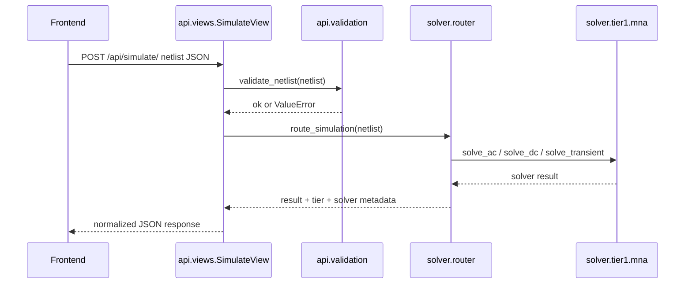

# CircuitSim Backend Structure

Updated: 2026-05-25

This file describes the Python/Django backend for collaborators and AI models.

## Backend Purpose

The backend has four main jobs:

1. serve the web app;
2. expose simulation APIs;
3. validate netlist contracts;
4. route valid requests to the correct simulation engine.

The backend is intentionally small. Most user interaction happens in the
frontend; the backend is the numerical authority.

## Directory Map

```text
circuitsim/
  manage.py
  config/
    settings.py
    urls.py
    wsgi.py
    asgi.py
  api/
    apps.py
    urls.py
    views.py
    validation.py
  solver/
    registry.py
    router.py
    tier1/
      mna.py
```

## Request Flow



## `api/views.py`

Main classes:

- `SimulateView`
- `HealthView`
- `ManualOpenView`

### `SimulateView`

Endpoint: `POST /api/simulate/`

Responsibilities:

- parse JSON;
- call `validate_netlist`;
- time the solver execution;
- call `route_simulation`;
- normalize the solver response;
- return errors with appropriate status codes.

Expected error behavior:

- invalid JSON: `400`;
- validation or solver contract error: `422`;
- unexpected solver exception: `500`.

### `HealthView`

Endpoint: `GET /api/health/`

Returns a small JSON status payload.

### `ManualOpenView`

Endpoint: `POST /api/manual/open/`

Opens the configured PDF manual in SumatraPDF at a topic page. This endpoint is
local-machine oriented and should be made configurable before deployment.

Current manual topics:

- `passivi`
- `attivi`
- `alimentatori`
- `trasformatori`
- `mcu`
- `digitale`
- `strumenti`

## `api/validation.py`

Central validation module for the simulation API contract.

Primary entry point:

```python
validate_netlist(netlist: dict) -> None
```

Validation responsibilities:

- `components` must be a non-empty list;
- `analysis` must be an object;
- `analysis.type` must be supported by `solver.registry.SUPPORTED_ANALYSES`;
- component type must exist in `solver.registry.COMPONENT_REGISTRY`;
- node count must match the backend component contract;
- numeric values must match the component value rule;
- voltage source signal fields must be valid.

Voltage source supported signal values:

- `dc`
- `sine`
- `step`
- `ac`

Voltage source optional fields:

- `dc`
- `amplitude`
- `ac_amplitude`
- `frequency`
- `offset`
- `phase`
- `step_initial`
- `step_final`
- `step_time`

## `solver/registry.py`

This is the backend capability registry. It should be treated as a platform
contract.

Important objects:

```python
SUPPORTED_ANALYSES = frozenset({"ac", "dc", "transient", "sinusoidal"})
COMPONENT_REGISTRY: dict[str, ComponentSpec]
NONLINEAR_COMPONENT_TYPES = frozenset(...)
```

`ComponentSpec` fields:

- `netlist_type`
- `terminal_count`
- `value_rule`
- `tier1_supported`
- `passive`

Current backend-supported component types:

| Type | Terminals | Value rule | Tier 1 |
|---|---:|---|---|
| `resistor` | 2 | positive | yes |
| `capacitor` | 2 | positive | yes |
| `inductor` | 2 | positive | yes |
| `voltage_source` | 2 | numeric | yes |
| `current_source` | 2 | numeric | yes |
| `bjt_npn` | 3 | positive | yes, small-signal |

Note: frontend-only types such as `potentiometer`, `switch_spst`, and `led_*`
are expanded into backend-supported primitives before reaching the API.

## `solver/router.py`

The router decides which solver tier can handle a netlist.

Current rule:

- use Tier 1 if:
  - no unsupported nonlinear component is present;
  - number of passive components is within the Tier 1 limit;
  - analysis type is supported;
  - all component types are Tier 1 compatible.

Current Tier 1 passive limit:

```python
_TIER1_MAX_PASSIVES = 50
```

Dispatch table:

| Analysis type | Solver function |
|---|---|
| `ac` | `tier1.solve_ac` |
| `dc` | `tier1.solve_dc` |
| `transient` | `tier1.solve_transient` |
| `sinusoidal` | `tier1.solve_sinusoidal` legacy compatibility |

## Backend Extension Guidelines

When adding a backend-supported component:

1. add it to `solver/registry.py`;
2. define its validation rules in `api/validation.py` if it needs custom fields;
3. update `solver/router.py` if it affects tier selection;
4. implement its stamp in `solver/tier1/mna.py` or route it to a higher tier;
5. add API tests and solver tests.

When adding a new analysis mode:

1. add the name to `SUPPORTED_ANALYSES`;
2. validate its analysis parameters;
3. add a router branch;
4. implement a solver method;
5. normalize the API response in `api/views.py`;
6. update frontend controls and docs.

## Known Backend Weak Points

- Manual opening is Windows/Sumatra-specific and hard-coded.
- The backend and frontend registries are separate files.
- Tier 1 can only approximate nonlinear components.
- There is no persisted project/circuit storage endpoint yet.
- There is no batch simulation endpoint yet.

